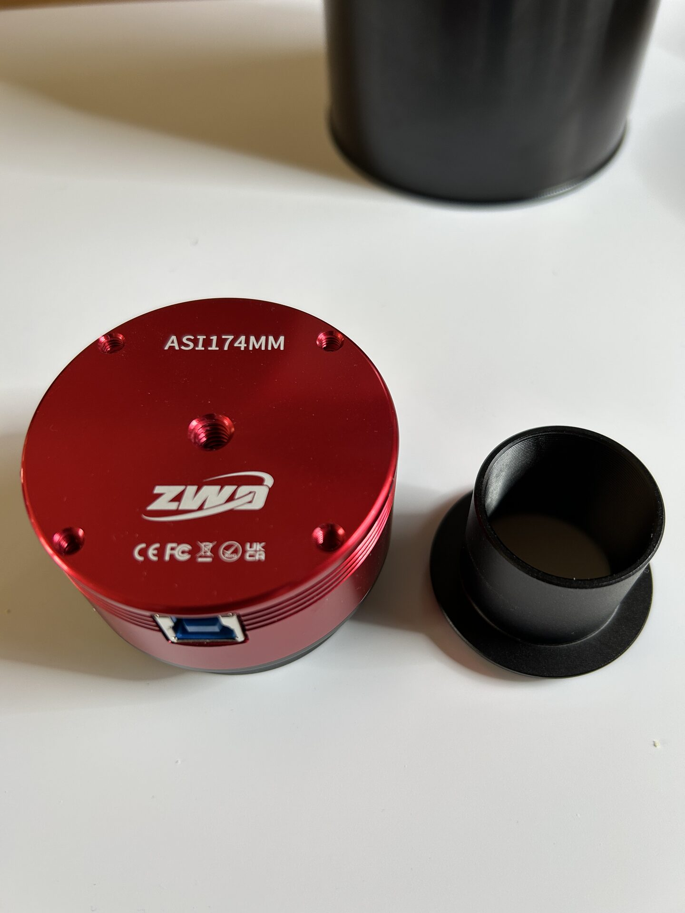
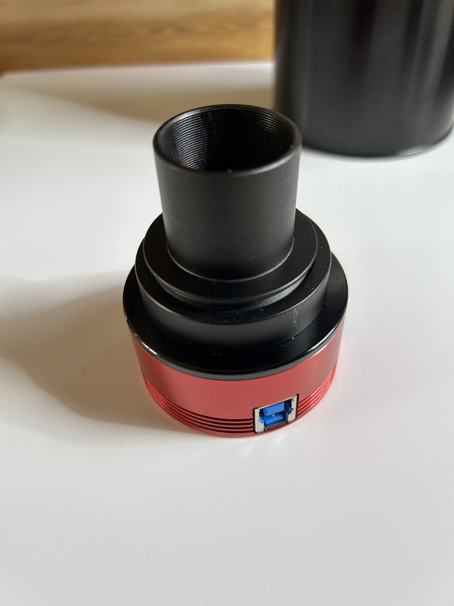

# Camera and Adapter Overview

The ASI174MM comes with a T2-to-1.25" adapter, allowing the camera to be mounted like a standard 1.25" eyepiece.

While this is useful in some configurations, it is recommended to use the T2 thread connection whenever possible. Threaded connections are mechanically more stable, reduce potential for tilt, and allow for more secure long-term mounting during imaging.

When attaching or removing the camera from a T2 connection, always hold the black base section of the camera. Gripping only the red housing may cause the body to unscrew from its base, exposing the sensor and internal electronics.

When using the T2 connection, it is best to connect the USB cable after the camera is fully mounted. However, when using the 1.25" eyepiece adapter, connecting the USB cable before insertion can help gravity rotate the camera into a natural and stable orientation.

This manual favors T2 mounting as the default unless specific hardware requires a 1.25" interface.

<figure markdown="span">
  { style="width:30%;" }
  <figcaption>The camera (Red) and its T2-1.25" adapter (black)</figcaption>
</figure>

<figure markdown="span">
  { style="width:30%;" }
  <figcaption>The camera (red) with the T2-1.25" adapter (black) mounted: Now can be mounted to any 1.25" eyepiece holder</figcaption>
</figure>
