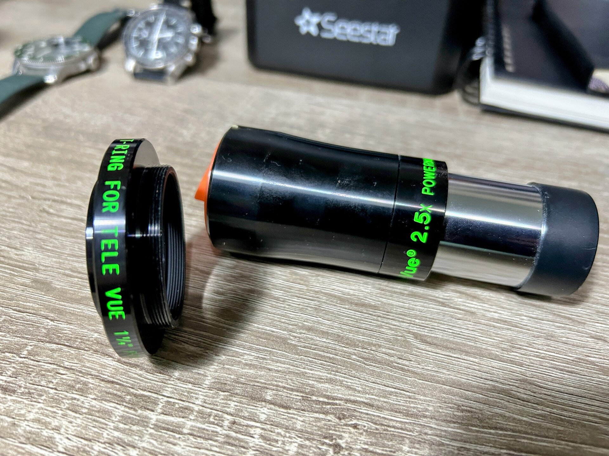
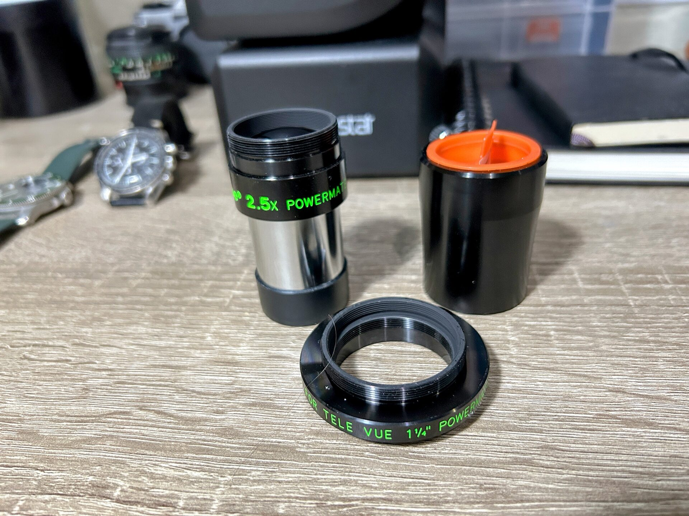
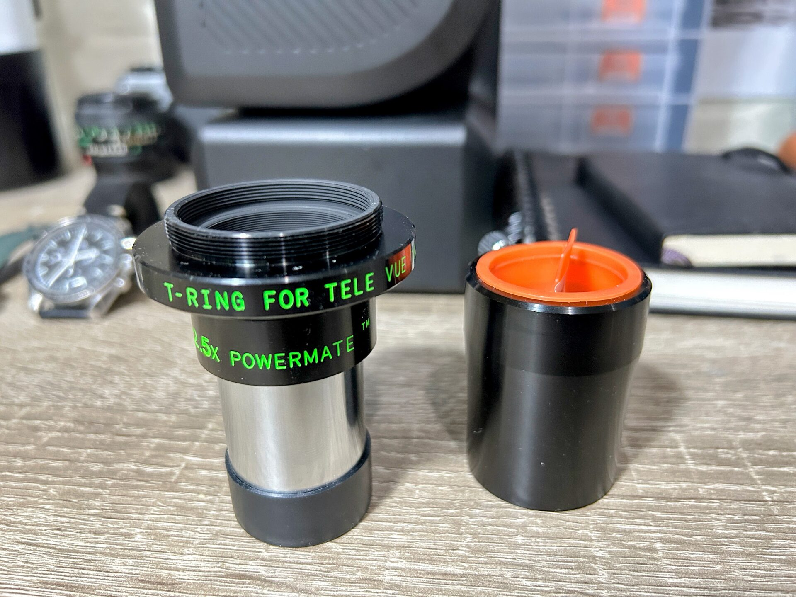

# Configuring the Powermate 2x for T2 Mounting

The Powermate 2x consists of two parts:

The optical element

The removable eyepiece holder

To prepare the Powermate for use with the ASI174MM via T2 threads, unscrew the eyepiece holder and replace it with the T2 adapter ring.

If the T2 adapter doesn’t seem to fit at first, check its orientation. The correct side to thread in is the one where, when mounted, the printed text on both parts is not upside down relative to each other.

Once attached, the Powermate is ready for secure, threaded connection to the camera.

This is the configuration of the Powermate 2x used in the next two use cases.

<figure markdown="span">
  { style="width:30%;" }
  <figcaption>The Powermate 2x (long cylinder) And The T2 Adapter Ring</figcaption>
</figure>

<figure markdown="span">
  { style="width:30%;" }
  <figcaption>The Powermate 2x With Eyepiece Holder Unscrewed</figcaption>
</figure>

<figure markdown="span">
  { style="width:30%;" }
  <figcaption>The Powermate 2x With T2 Adapter Ring Screwed In</figcaption>
</figure>
