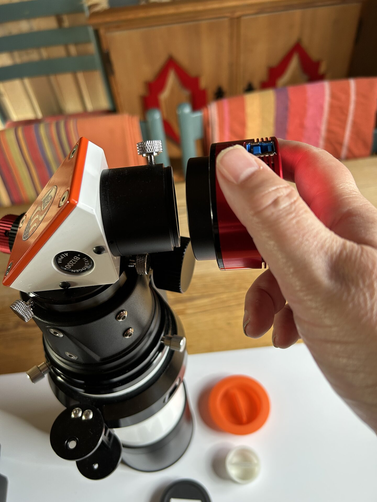
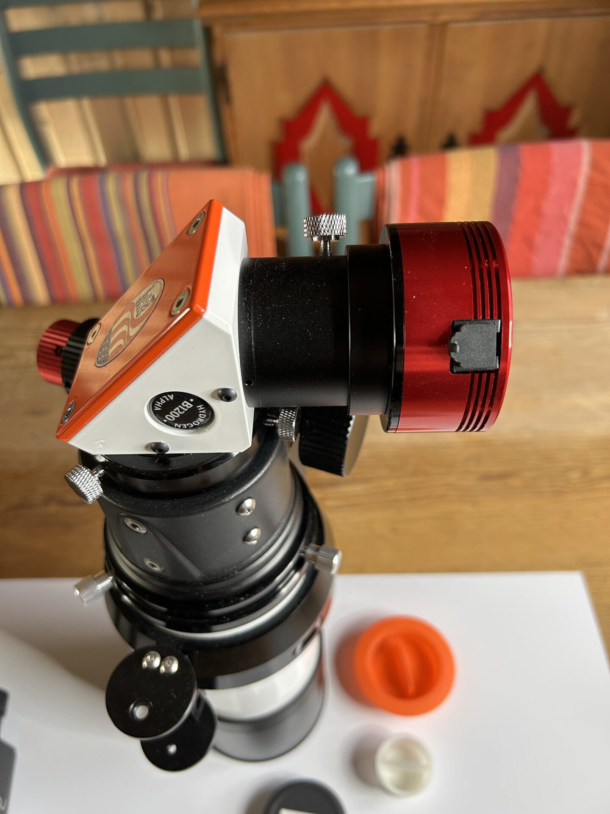

# H-Alpha Full Disk Imaging

Mount the ASI174MM directly to the B1200 blocking filter diagonal using the T2 thread connection.

No additional adapters are needed. This configuration provides a full-disk solar image (depending on seeing and camera spacing) and uses the most stable mechanical interface.

<figure markdown="span">
  { style="width:30%;" }
  <figcaption>Mounting the camera on B1200 blocking diagonal using T2 threads</figcaption>
</figure>

<figure markdown="span">
  { style="width:30%;" }
  <figcaption>The camera mounted</figcaption>
</figure>
