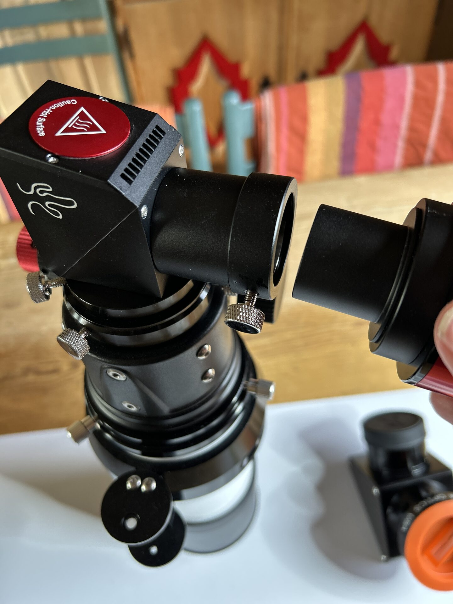

# White Light Full Disk Imaging

Insert the T2-to-1.25" eyepiece adapter into the Lunt Herschel wedge.

Mount the ASI174MM into the adapter and secure it using the thumb screw.

This is the only configuration that requires using the eyepiece-style connection, as the Herschel wedge does not offer T2 threads. Ensure the camera is seated firmly and the thumb screw is tight before imaging.

<figure markdown="span">
  { style="width:30%;" }
  <figcaption>Inserting Camera In The Lunt Herschel Wedge Using The T2 - 1.2" Adapter</figcaption>
</figure>
