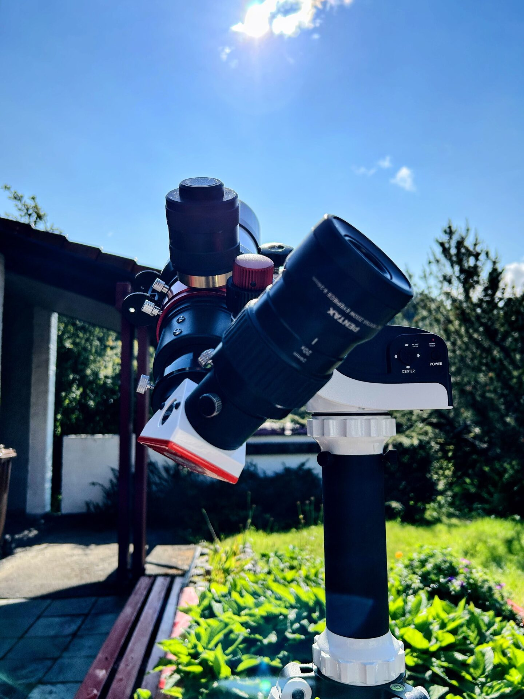

# Inserting Equipment In The B1200 diagonal

When using the B1200 blocking filter diagonal, always angle it to the right side of the telescope (as seen from the rear). This ensures that gravity helps keep any inserted equipment seated in the diagonal, rather than applying torque that could loosen the diagonal from its threaded 2" base.

Angling the diagonal to the left may cause gravity to assist in unthreading the diagonal from its 2" base, especially when using heavier accessories. This has specifically occurred with the Pentax Zoom, due to its weight and leverage, but the principle applies more generally.

This is not a problem with the equipment itself — the Pentax Zoom is safe to use — but correct diagonal orientation prevents unintended loosening during use.

<figure markdown="span">
  { style="width:30%;" }
  <figcaption>B1200 Blocking Filter Correctly Angled</figcaption>
</figure>
