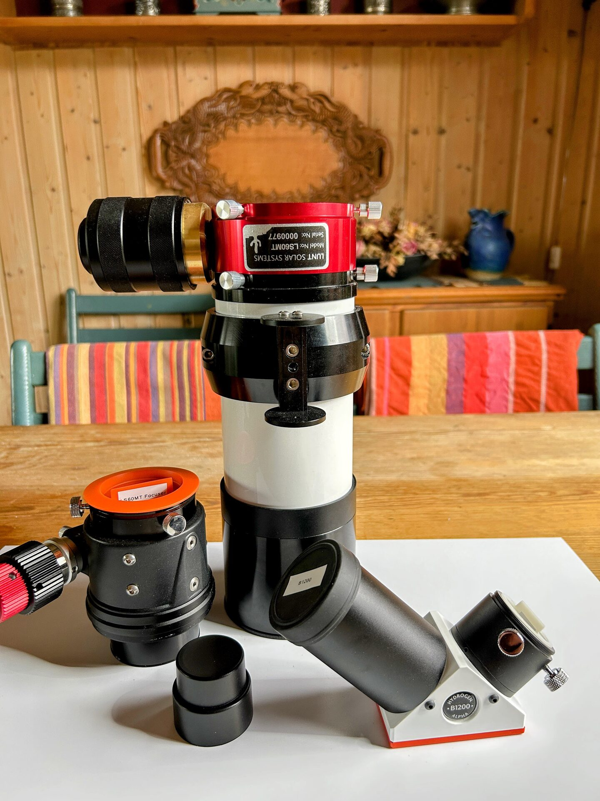

# Install The Etalon Module

Mount the Etalon module in place of the focuser, as shown in the image. The plate with the serial number and Lunt cactus logo should align with the Tele Vue solar finder. Ensure all three thumb screws securing the Etalon module are tightened before proceeding.

<figure markdown="span">
  { style="width:30%;" }
  <figcaption>LS60MT With Etalon Module Installed</figcaption>
</figure>
