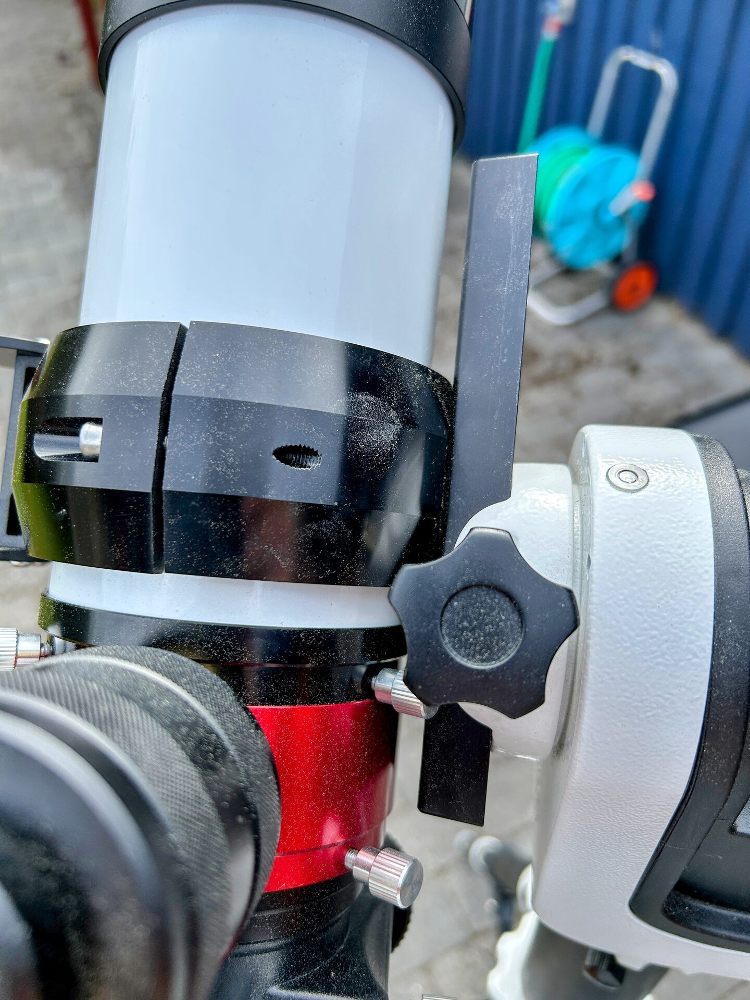

# Mounting the Dovetail: Positioning

When attaching the telescope to the mount, the dovetail should be inserted almost all the way forward in the saddle track — close to the front stop, as shown in the image.

This forward mounting position helps maintain stable balance in the altitude (vertical) axis, particularly on alt-azimuth mounts.

Even with minimal equipment at the rear, this configuration is stable. If mounted near the center of the dovetail, heavier accessories — such as the 0.5 kg Pentax Zoom — can cause the telescope to tilt backward unexpectedly, resulting in unwanted altitude motion or tracking instability.

Forward positioning avoids imbalance and ensures smoother operation.

<figure markdown="span">
  { style="width:30%;" }
  <figcaption>Correct Mounting</figcaption>
</figure>
