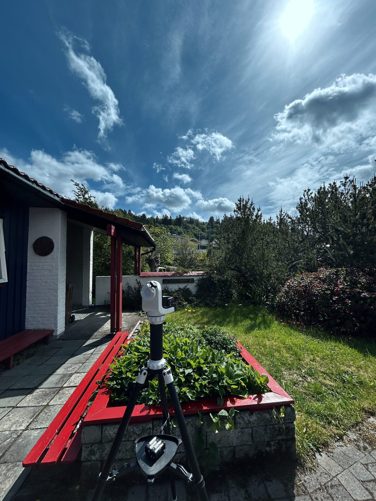

# Placing The Tripod With The SolarQuest Mount Before Mounting Telescope

Position the tripod and SolarQuest mount at the intended observing location before mounting the telescope. There is no need to spend time on precise leveling; the mount reliably tracks the Sun even with moderate unevenness. Field experience confirms stable tracking from morning to evening without adjustment.

Do not aim the mount toward the Sun. Leave it pointed in a safe, arbitrary direction. This ensures that the dovetail saddle is not facing the Sun during mounting, reducing the risk of looking into sunlight during alignment. The SolarQuest mount performs automatic solar alignment after power-on, handling Sun acquisition safely and independently.

<figure markdown="span">
  { style="width:30%;" }
  <figcaption>SolarQuest mount on tripod not facing sun</figcaption>
</figure>
