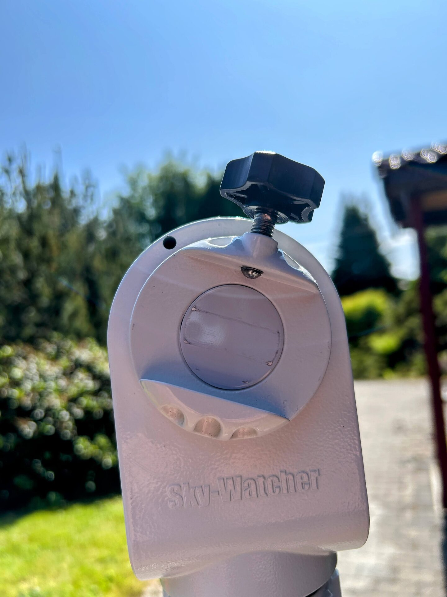

# Preparing The Mount Saddle

Before mounting the telescope, ensure that the locking knob on the mount saddle is fully disengaged from the dovetail slot. After dismounting the telescope, the locking knob is often left partially threaded into the slot. This can obstruct the dovetail bar when sliding the telescope back into position.

Although it is possible to clear the obstruction while holding the telescope, it is safer and smoother to confirm that the saddle track is fully clear before mounting. This practice helps avoid fumbling and promotes good handling habits, especially as equipment size and weight increase.

<figure markdown="span">
  { style="width:30%;" }
  <figcaption>Locking knob blocking smooth mounting of telescope</figcaption>
</figure>
