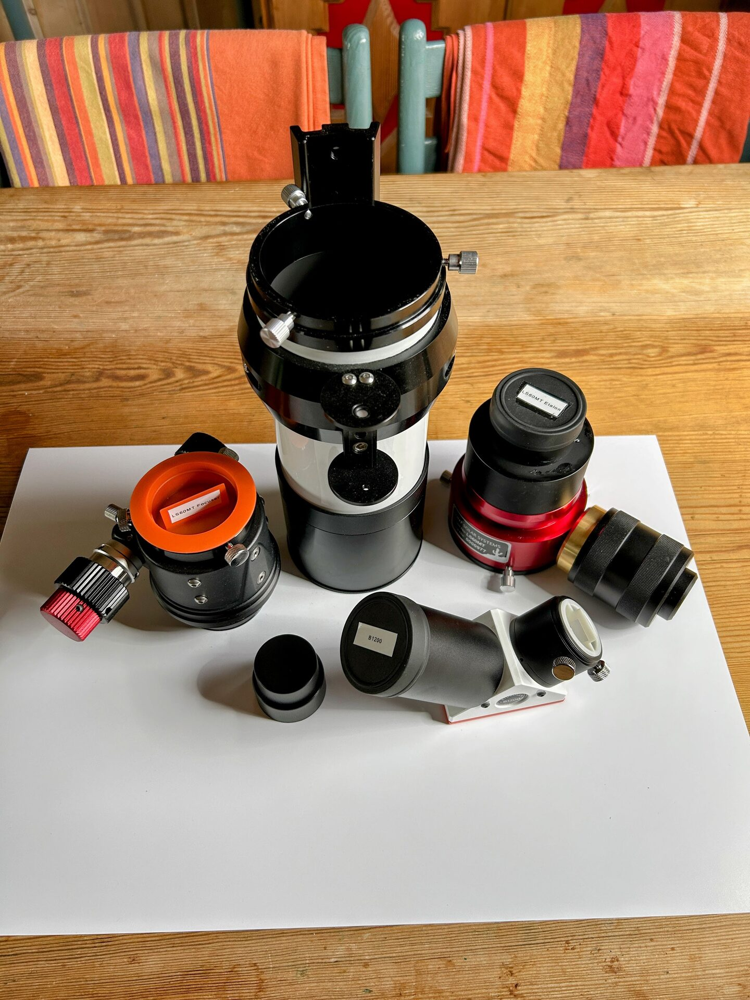

# Remove The focuser

Loosen the tumb screws holding the focuser in place and remove the focuser, image shows the LS60MT with the focuser removed.

<figure markdown="span">
  { style="width:30%;" }
  <figcaption>LS60MT Telescope Only</figcaption>
</figure>
