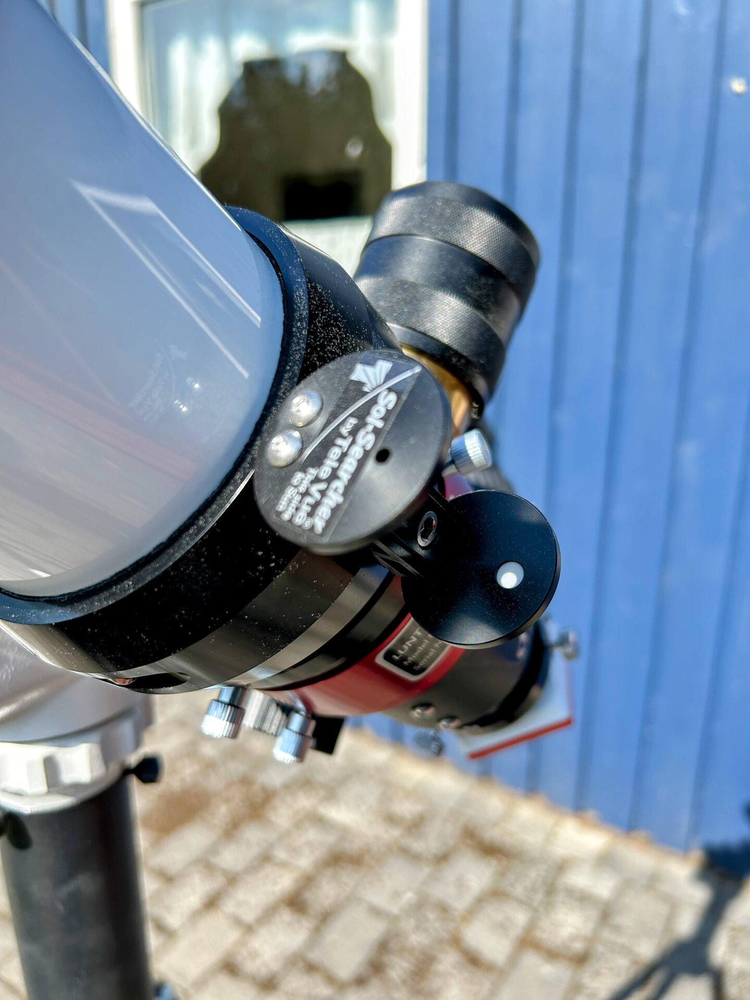

# Use of the Tele Vue Solar Finder

The Tele Vue Solar Finder is not strictly required when using the SolarQuest mount, as the mount reliably locates and tracks the Sun automatically. However, the finder is useful as a quick visual confirmation that the telescope is properly aligned.

When returning to the scope after a break, the pinhole projection provides immediate confirmation that the Sun is still centered. There have been cases where tracking was lost — for example, due to dead batteries or clouds blocking the Sun during initial alignment. Even if the sky is clear upon return, the mount may not have completed correction if cloud cover was present earlier.

The solar finder is especially helpful during imaging sessions: if nothing appears on the screen, but the Sun is visible through the pinhole, the scope is correctly aimed and the issue lies elsewhere (e.g., exposure settings, focus, or camera connection).

<figure markdown="span">
  { style="width:30%;" }
  <figcaption>Sun In View</figcaption>
</figure>
