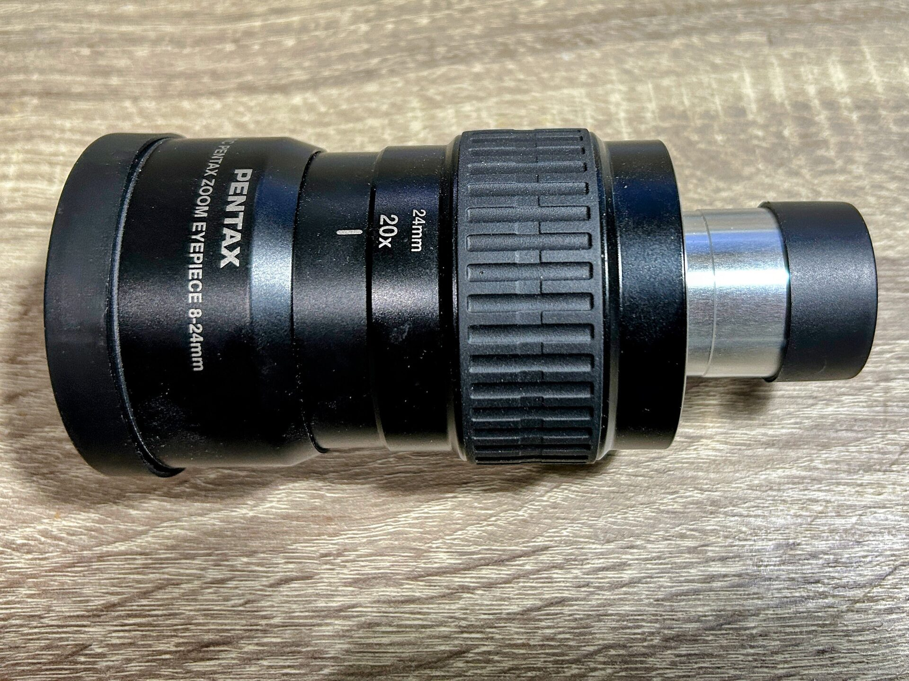

# Using The 8-24 mm Pentax Zoom

When using the 8–24 mm Pentax Zoom for solar observation, it should be set to its widest setting (24 mm) before mounting.

This ensures:

The sharpest possible view under current seeing conditions (as a reliable starting point for further zooming)

The Sun is visible in the field of view, even if slightly off-center due to mount memory or Etalon tuning offset

Starting at minimum magnification helps avoid losing the Sun during initial viewing, especially after imaging or tuning adjustments.

<figure markdown="span">
  { style="width:40%;" }
  <figcaption>The zoom at widest setting (24 mm)</figcaption>
</figure>
