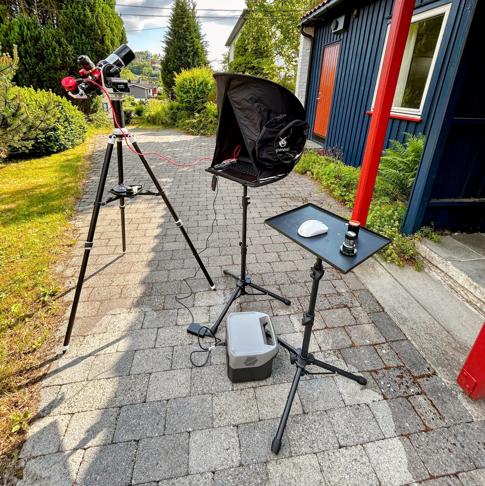

# Introduction

This manual documents the current equipment, configurations, and handling practices used in the aha-astrolab astronomy setup.

Its purpose is to provide clear, step-by-step guidance for safely and effectively operating the instruments, with a focus on solar observation and light visual use at night. It covers mechanical setup, component usage, practical tips, and workflow habits based on direct experience.

This manual will not teach amateur astronomy, but it is intended to support such endeavors by making the equipment easier to use and reducing friction during sessions.

Reading it is strongly recommended before using the system — unless, of course, you are already a very experienced telescope handler.

The manual does not include theoretical background, observing techniques, or astrophotography processing instructions. These are considered out of scope, though occasional context may be mentioned where relevant to equipment handling.

All procedures reflect the present state of the equipment. Future upgrades or reconfigurations may be documented separately or as additions to this manual.

<figure markdown="span">
  { style="width:40%;" }
  <figcaption>Instruments and equipments of the aha-astrolab in use (imagining the sun in h-alpha light)</figcaption>
</figure>
