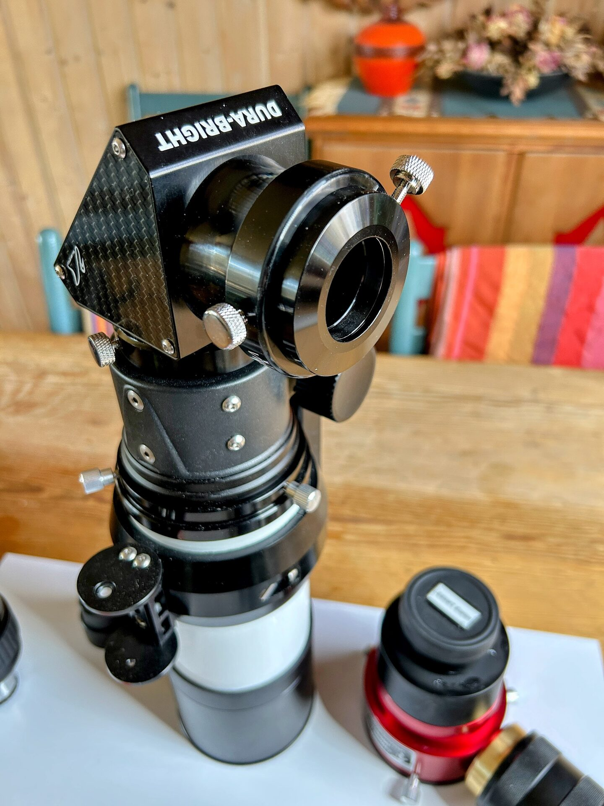

# LS60MT Night Configuration

The LS60MT configured for use as a regular nighttime telescope. Be sure to read the description below the image.

!!! danger "Never point at the Sun"
    In this configuration no solar filters are mounted. The telescope must never be pointed at the Sun.

<figure markdown="span">
  { style="width:40%;" }
  <figcaption>LS60MT Ready For Night Observing / Imaging</figcaption>
</figure>

- No solar filters are mounted. **The telescope must not be used for any solar work.**
- The William Optics Diagonal is mounted with its included 2-inch to 1.25-inch reducer, allowing use of the Pentax Zoom. The same reducer is also used for mounting the Lunt Herschel Diagonal in the white light configuration.
