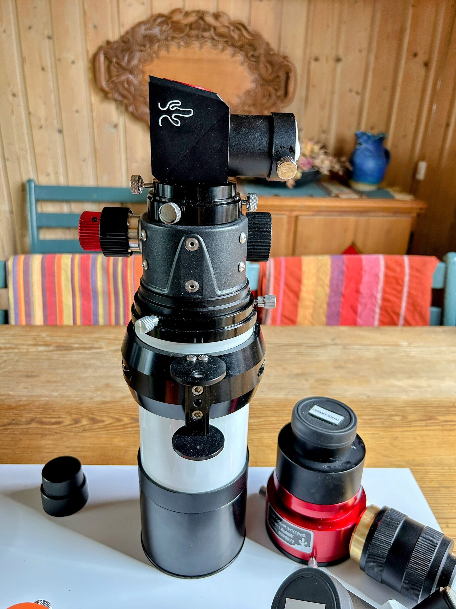

# LS60MT White Light Solar Configuration

The LS60MT configured for observing and imaging the Sun in white light. Be sure to read the description below the picture.

<figure markdown="span">
  { style="width:40%;" }
  <figcaption>LS60MT Ready For White Light Solar Observing / Imaging</figcaption>
</figure>

- The etalon filter module has been removed.
- Safe solar observation is provided by the Lunt Herschel Diagonal, identified by its black housing, Lunt cactus logo, and orange warning plate indicating a hot area.
- A 2-inch to 1.25-inch reducer is used to attach the diagonal to the focuser.
- The Baader Single Polarizing Filter should be used with the Pentax Zoom for visual observing to reduce brightness. It is not dangerous to observe without it, but the light is too bright for comfortable viewing.
