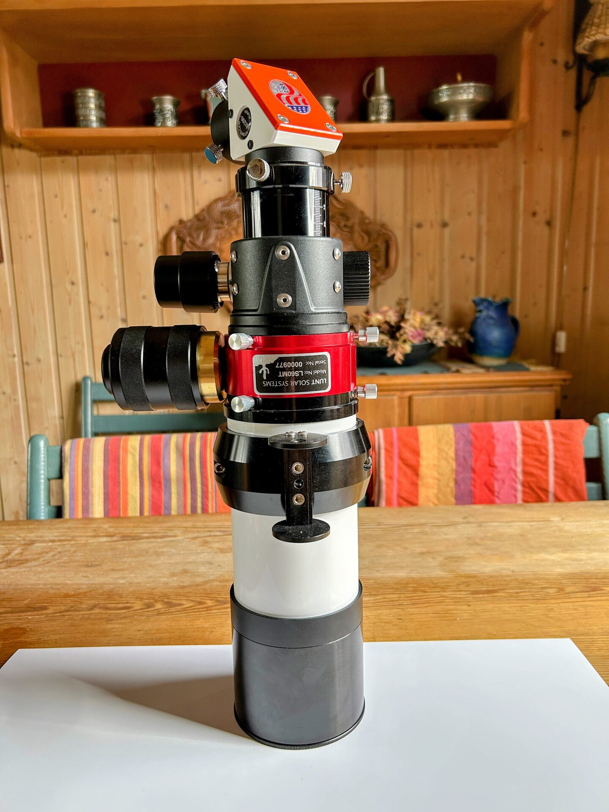

# Starting Configuration

The image shows the LS60MT configured for H-Alpha observation, with the etalon module and the blocking filter installed. This topic shows how to go from this configuration to the night observing configuration.

<figure markdown="span">
  { style="width:40%;" }
  <figcaption>LS60MT Ready For H-Alpha Solar Observing / Imaging</figcaption>
</figure>
