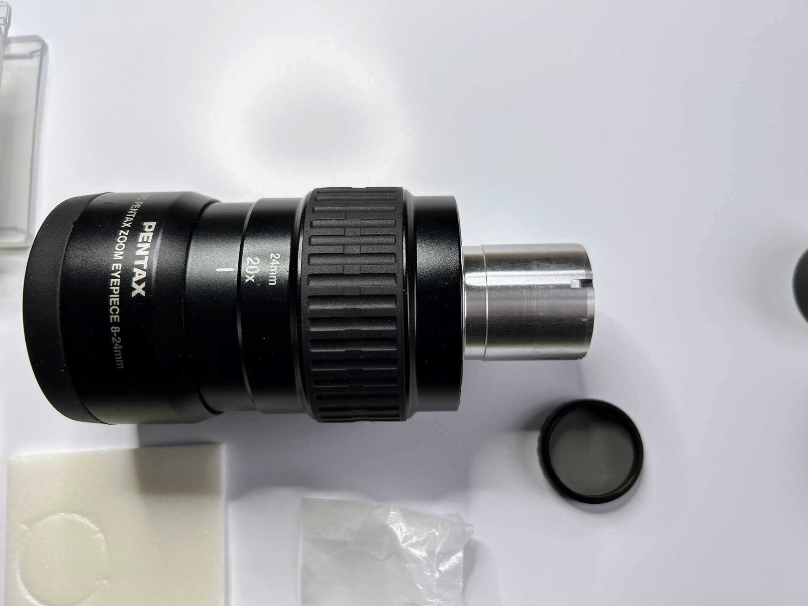
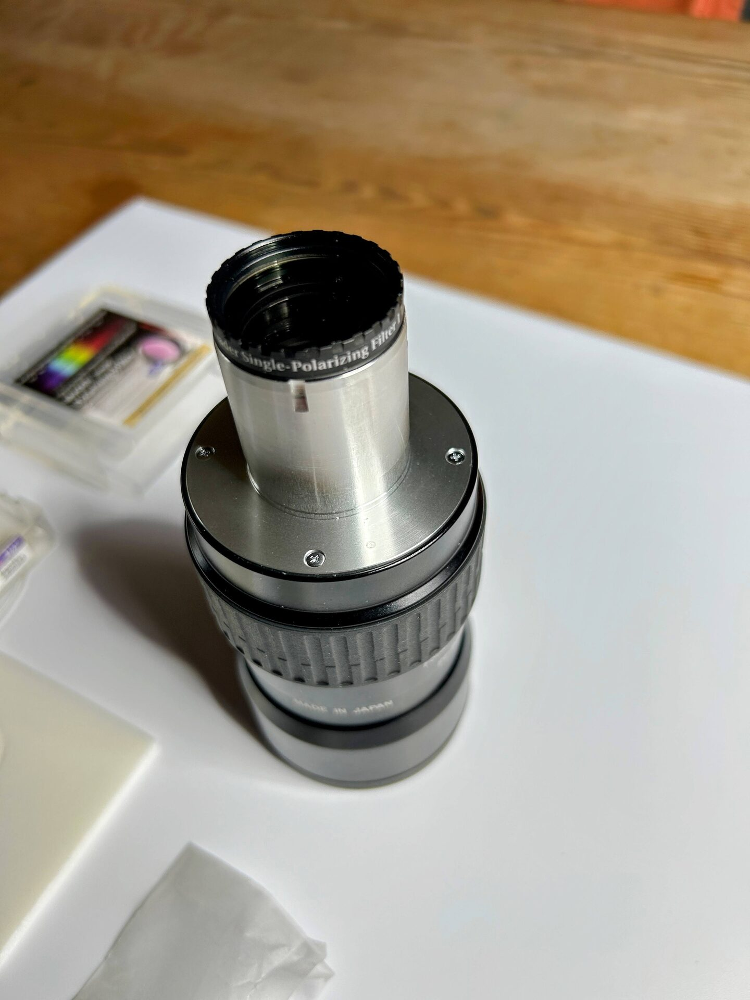

# Mount the Pentax Zoom Eyepiece

Insert the Pentax Zoom eyepiece into the Herschel wedge and secure it with the thumb screw.

Before mounting, screw the Baader single polarizing filter into the bottom of the eyepiece. This significantly reduces glare during visual observation.

To use the filter effectively, keep the thumb screw slightly loose so the eyepiece can be rotated. Slowly turn the eyepiece while viewing until the image appears darkest — this is the point of maximum glare reduction.

The Baader filter is a single polarizing filter, but it works in this configuration because the Herschel wedge itself acts as a polarizing element. Together, they allow effective light suppression through alignment of polarization axes.

<figure markdown="span">
  { style="width:30%;" }
  <figcaption>The Pentax Zoom With Baader Single Polarizing Filter</figcaption>
</figure>

<figure markdown="span">
  { style="width:30%;" }
  <figcaption>The Pentax Zoom With The Badder Single Polarizing Filter Screwed In</figcaption>
</figure>
