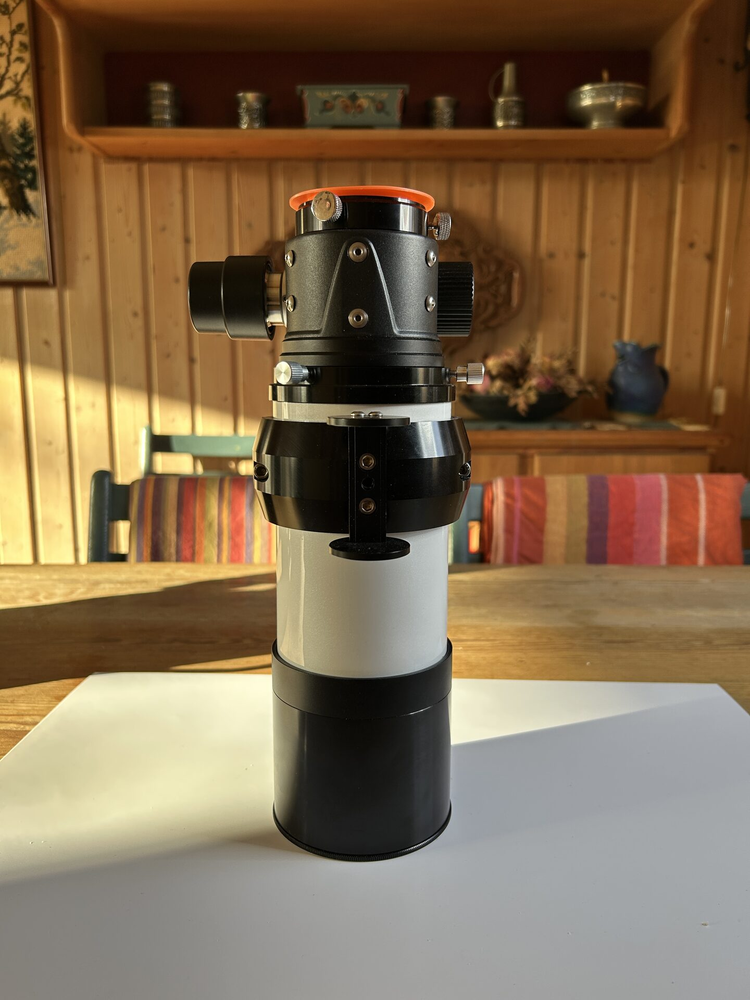

# Reattach the Focuser

Mount the focuser directly onto the telescope and secure it using the three thumb screws.

Ensure all screws are properly tightened before proceeding.

<figure markdown="span">
  { style="width:30%;" }
  <figcaption>Focuser Mounted On Scope</figcaption>
</figure>
