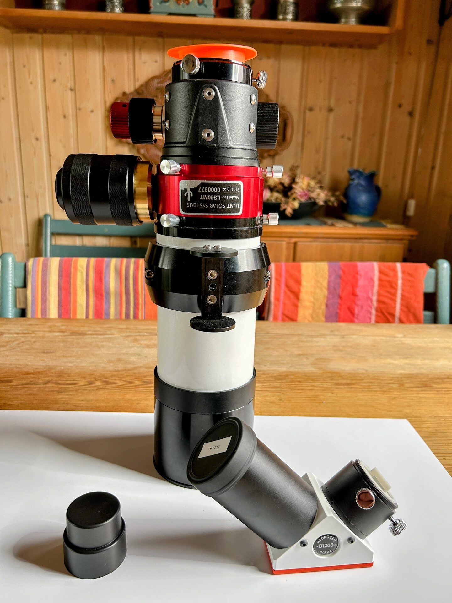

# Remove The B1200 Blocking Filter Diagonal

Loosen the thumb screw on the focuser and carefully remove the B1200 blocking filter diagonal.

After removal, attach the appropriate dust covers to both the diagonal and the focuser to protect internal surfaces during the reconfiguration.

<figure markdown="span">
  { style="width:30%;" }
  <figcaption>LS60MT With The B1200 Diagonal Removed</figcaption>
</figure>
